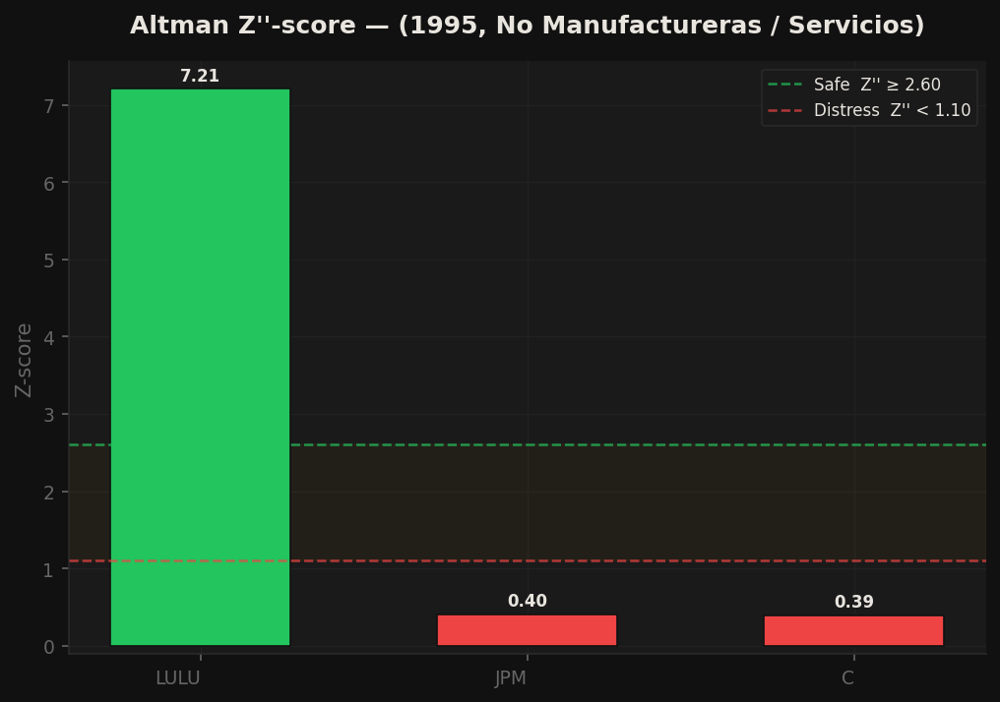
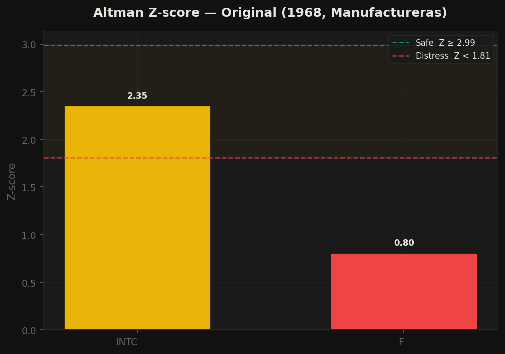
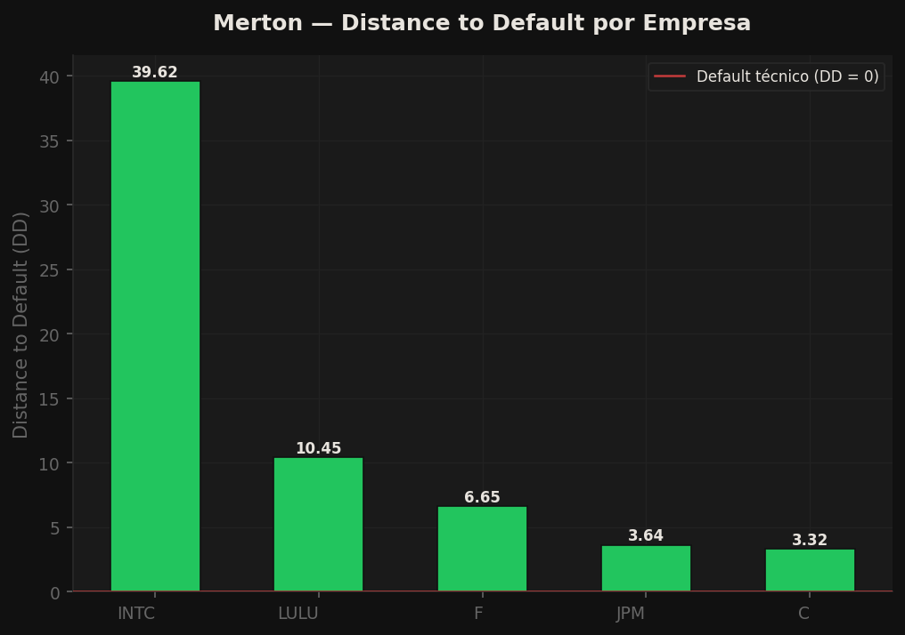
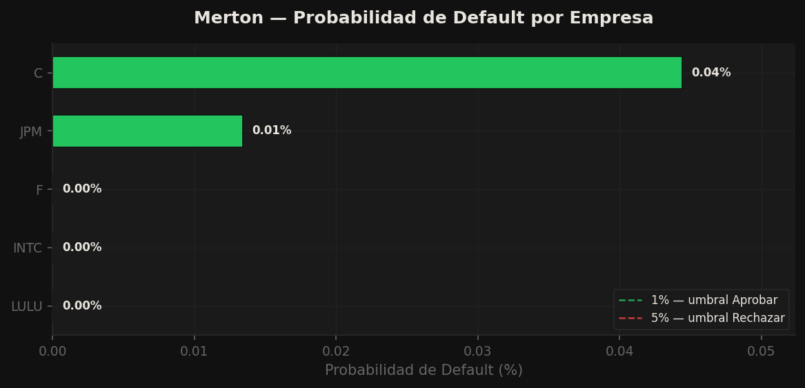
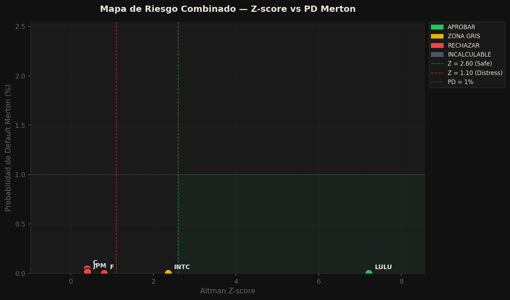

# Evaluación Crediticia: Altman Z-score y Modelo de Merton

**Fecha de generación:** 22 de febrero de 2026
**Empresas evaluadas:** 5
**Tickers:** C, JPM, F, INTC, LULU

## Propósito

Este reporte aplica dos modelos cuantitativos de riesgo crediticio para determinar
la viabilidad de otorgar crédito. Altman analiza la salud financiera contable;
Merton modela la probabilidad de default desde la teoría de opciones sobre activos.

La decisión consolidada requiere que ambos modelos coincidan en APROBAR.
Un rechazo en cualquiera de los dos es suficiente para escalar o rechazar.

---

## Modelos Utilizados

### Altman Z-score


## Altman Z-score

### Origen y fuente
Desarrollado por Edward I. Altman (1968) en la NYU Stern School of Business.
Extendido en 1983 (Z') para empresas privadas y en 1995 (Z'') para empresas
no manufactureras y mercados emergentes. Se usan los papers originales de
Altman como fuente primaria para evitar errores de transcripción de fuentes
secundarias.

### Por qué Altman
El Z-score es el modelo de predicción de quiebra más citado en finanzas
corporativas. Bancos comerciales, agencias de rating (Moody's, S&P) y
reguladores lo usan como screening inicial de crédito. Su fortaleza es la
interpretabilidad: cada ratio tiene significado económico claro.

### Las tres versiones

**Z original (1968)** — empresas manufactureras que cotizan en bolsa.
Usa cinco ratios ponderados. El ratio X4 incorpora el valor de mercado
del equity, lo que lo hace sensible a variaciones de precio bursátil.
Zonas: Safe > 2.99 | Grey 1.81–2.99 | Distress < 1.81

**Z' (1983)** — empresas manufactureras privadas.
Reemplaza el valor de mercado por el valor en libros del equity en X4,
recalibrando los coeficientes. Aplicable a empresas sin cotización pública.
Zonas: Safe > 2.90 | Grey 1.23–2.90 | Distress < 1.23

**Z'' (1995)** — empresas no manufactureras, servicios, mercados emergentes.
Elimina el ratio Ventas/Activos (X5) porque en empresas de servicios este
ratio refleja el modelo de negocio, no la salud financiera. Es el modelo
más universal y conservador de los tres.
Zonas: Safe > 2.60 | Grey 1.10–2.60 | Distress < 1.10

### Selección automática
El sistema detecta el sector e industria de Yahoo Finance y aplica el modelo
correspondiente sin intervención del usuario.

### Limitaciones
- Calibrado con datos de empresas de los años 60-90. Algunos sectores modernos
  (SaaS, fintech, biotech) pueden producir scores distorsionados.
- Z-score es un modelo estático: usa datos de un solo período fiscal.
- No produce probabilidad de default directamente.


### Modelo de Merton (1974)


## Modelo de Merton (1974)

### Origen y fuente
Desarrollado por Robert C. Merton (1974) como extensión del modelo de
Black-Scholes para valorar deuda corporativa con riesgo de default.
Merton recibió el Premio Nobel de Economía en 1997 en parte por este trabajo.
Fuente primaria: Merton (1974), *Journal of Finance*, 29(2), 449–470.

### Fundamento teórico
El equity de una empresa es conceptualizado como un call option europeo
sobre sus activos totales, con precio de ejercicio igual al valor facial
de la deuda al vencimiento T:

```
E = V_A · N(d1) - D · e^(-rT) · N(d2)
```

El default ocurre cuando V_A < D al tiempo T. La probabilidad de default
es la probabilidad de que el valor de activos caiga por debajo de la deuda.

### Implementación: versión de balance sheet
En lugar de la versión KMV (que requiere precios de mercado y resolución
iterativa del sistema de ecuaciones), se usan datos del balance directamente:

| Parámetro | Definición | Fuente |
|-----------|------------|--------|
| V_A | Total Assets — año más reciente | `yfinance` balance_sheet |
| D | Total Liabilities — año más reciente | `yfinance` balance_sheet |
| σ_A | Std. dev. de log-retornos históricos anuales de V_A | Serie histórica Total Assets |
| r | Rendimiento del Treasury a 10 años | `yfinance` ticker ^TNX |
| T | Horizonte temporal = 1 año | Parámetro fijo del modelo |

### Fórmulas

**Distance to Default:**

```
DD = [ ln(V_A / D) + (r - σ_A² / 2) · T ] / (σ_A · √T)
```

**Probabilidad de Default:**

```
PD = N(−DD) = 1 − N(DD)
```

donde N(·) es la función de distribución acumulada de la normal estándar.

### Interpretación del DD
DD representa cuántas desviaciones estándar separan el valor actual de
activos del punto de quiebra técnica (V_A = D). Un DD de 2.0 significa
que el valor de activos tendría que caer 2 desviaciones estándar para
alcanzar el nivel de default.

### Decisión crediticia

| Umbral PD | Zona | Decisión |
|-----------|------|----------|
| PD < 1% | <span class="decision-aprobar">Safe Zone</span> — equivalente aproximado a Investment Grade | APROBAR |
| PD 1–5% | <span class="decision-zona-gris">Grey Zone</span> — Sub-investment, requiere análisis adicional | ZONA GRIS |
| PD > 5% | <span class="decision-rechazar">Distress Zone</span> — High Yield / Distress | RECHAZAR |

### Diferencia con Altman
Altman clasifica mediante análisis discriminante sobre ratios contables.
Merton modela el proceso estocástico del valor de activos y deriva la PD
desde primeros principios de la teoría de opciones. Merton produce una
probabilidad continua (0–100%); Altman produce un score de clasificación.

### Limitaciones
- Con pocos años de datos (< 5), σ_A es una estimación ruidosa.
- Asume que V_A sigue un proceso log-normal — puede no cumplirse en crisis.
- No captura deuda estructurada, covenants, ni garantías colaterales.
- Los umbrales de PD son orientativos; en la práctica bancaria varían
  por política interna, sector y ciclo económico.

---

## Metodología y Fuentes de Datos

### Fuente de datos financieros: Yahoo Finance vía `yfinance`

Los estados financieros se obtienen a través de la librería `yfinance`, que expone
la API no oficial de Yahoo Finance y provee hasta 10 años de información anual auditada
por empresa pública. Se utiliza esta fuente porque es de acceso abierto, cubre la
mayoría de empresas listadas en mercados regulados, y sus datos provienen de los
reportes SEC (10-K) o equivalentes internacionales. A continuación se justifica
la elección de cada variable que alimenta el modelo de Merton:

---

#### V_A — Valor de los activos: `Total Assets`

`Total Assets` es la suma de todos los activos de la empresa en el balance sheet.
En el modelo estructural de Merton (1974), V_A representa el valor de mercado de los
activos de la firma, que sigue un proceso de difusión geométrico browniano. Dado que
el valor de mercado de los activos no se observa directamente (solo se observa el
equity en bolsa), en la versión de balance sheet se usa `Total Assets` como proxy
del valor contable de los activos. Esta aproximación es estándar en implementaciones
académicas sin acceso al sistema iterativo KMV.

Fuente en `yfinance`: campo `Total Assets` del `balance_sheet` (DataFrame de Yahoo Finance).

---

#### D — Punto de default: `Total Liabilities`

El punto de default D es el umbral de valor de activos a partir del cual se produce
incumplimiento técnico (V_A < D al tiempo T). La especificación canónica del punto
de default proviene de Crosbie y Bohn (2003) en el framework KMV de Moody's:

```
D_KMV = Deuda de Corto Plazo (STD) + 0.5 × Deuda de Largo Plazo (LTD)
```

Esta fórmula refleja el argumento económico de que solo la deuda de corto plazo
presiona la liquidez en el horizonte T = 1 año, mientras que la deuda de largo plazo
pondera al 50% porque representa obligaciones futuras que el mercado descuenta pero
que no vencen en el horizonte inmediato.

**Por qué no se usa D_KMV en este sistema:**
Yahoo Finance reporta `Current Debt` y `Long Term Debt` de manera inconsistente entre
tickers: algunos incluyen arrendamientos capitalizados, otros los excluyen; en empresas
de sectores no financieros frecuentemente aparecen valores nulos o combinados bajo
etiquetas como `Current Debt And Capital Lease Obligation`. Aplicar D_KMV con datos
parciales o inconsistentes produce un punto de default artificialmente bajo y, por tanto,
un DD sobreoptimista que no refleja el riesgo real.

La literatura académica de crédito (Bharath & Shumway, 2008; Hillegeist et al., 2004)
valida el uso de `Total Liabilities` como punto de default conservador cuando no se
dispone del desglose STD/LTD confiable. Esta especificación es más estricta que D_KMV
(D_TL ≥ D_KMV para cualquier empresa con deuda de largo plazo), lo que resulta en un
DD menor y una PD mayor. En un contexto de análisis crediticio, el sesgo conservador
es preferible a subestimar el riesgo.

Fuente en `yfinance`: campo `Total Liabilities Net Minority Interest` del `balance_sheet`.

---

#### σ_A — Volatilidad de los activos: desviación estándar de log-retornos históricos

El modelo de Merton asume que el valor de activos sigue:

```
dV_A = μ · V_A · dt + σ_A · V_A · dW_t
```

Donde σ_A es la volatilidad anual del proceso log-normal. Se estima como la
desviación estándar muestral (ddof=1) de los log-retornos anuales de Total Assets:

```
log_return_t = ln(V_A(t) / V_A(t-1))
σ_A = std({ log_return_t }, ddof=1)
```

Se usan log-retornos porque son consistentes con el supuesto de proceso log-normal:
si V_A es log-normal, entonces ln(V_A(t)/V_A(t-1)) es normal con media (μ - σ²/2)·Δt
y varianza σ²·Δt.

Fuente en `yfinance`: serie histórica de `Total Assets` (hasta 10 años).
Con menos de 5 observaciones, σ_A es un estimador ruidoso — el reporte lo señala
explícitamente como advertencia.

---

#### r — Tasa libre de riesgo: rendimiento del Treasury a 10 años

La tasa libre de riesgo r se obtiene en tiempo real del ticker `^TNX` de Yahoo Finance,
que corresponde al rendimiento del bono del Tesoro de Estados Unidos a 10 años.
Se usa como parámetro de drift bajo la medida risk-neutral Q, consistente con la
valoración Black-Scholes sobre la que se fundamenta Merton (1974).

En la fórmula de Distance to Default implementada:

```
DD = [ln(V_A / D) + (r - σ_A² / 2) · T] / (σ_A · √T)
```

El drift del numerador es `(r - σ_A²/2)`, correspondiente a la medida de valoración
risk-neutral (Merton, 1974, eq. 12), en la que el drift esperado de los activos bajo Q
es igual a r.

Fuente en `yfinance`: ticker `^TNX` (CBOE Interest Rate 10-Year T-Note), obtenido el
día de la ejecución del análisis.

---

#### T — Horizonte temporal: 1 año

T = 1 año es el horizonte estándar en análisis de crédito a corto plazo. Crosbie y Bohn
(2003) lo justifican como el horizonte de revisión crediticia típico de bancos y agencias
de rating. Altman y Saunders (1998) señalan que horizontes mayores aumentan la
incertidumbre de los parámetros sin mejorar la capacidad predictiva para decisiones
de otorgamiento de crédito. T es un parámetro fijo del modelo configurable en el
constructor de `MertonModel`.

---

### Selección automática de versión de Z-score

El sistema detecta el sector e industria de cada empresa vía Yahoo Finance y aplica
la versión correcta del Z-score sin intervención del usuario (Z original, Z' o Z'').

---

## Resultados por Empresa

### C — Citigroup Inc.
**Sector:** Financial Services | **Industria:** Banks - Diversified
**Decisión Consolidada:** <span class="decision-rechazar">RECHAZADO</span>
**Razonamiento:** Rechazado por: Altman (Distress Zone, Z=0.388)

#### Altman Z-score
- **Modelo aplicado:** Altman Z''-score (1995, No Manufactureras)
- **Score:** 0.388
- **Zona:** <span class="decision-rechazar">Distress Zone</span>
- **Decisión:** <span class="decision-rechazar">RECHAZADO</span>

**Componentes:**

| Ratio | Valor |
|-------|-------|
| X1_working_capital_to_assets | 0.0 |
| X2_retained_earnings_to_assets | 0.0877 |
| X3_ebit_to_assets | 0.0 |
| X4_book_equity_to_liabilities | 0.0973 |

**Advertencias:**
- <span class="label-advertencia">ADVERTENCIA</span> Working Capital calculado con datos parciales.

#### Modelo de Merton
- **Distance to Default (DD):** 3.324
- **Probabilidad de Default (PD):** 0.0444%
- **Zona:** <span class="decision-aprobar">Safe Zone</span>
- **Decisión:** <span class="decision-aprobar">APROBADO</span>
- **Años de datos usados:** 4

**Componentes:**

| Parámetro | Valor |
|-----------|-------|
| V_A_total_assets_current | 2352945000000.0 |
| D_default_point_KMV | 2143579000000.0 |
| D_method | Total Liabilities |
| sigma_A_log_returns | 0.040086 |
| leverage_D_over_VA | 0.911 |
| ln_VA_over_D | 0.093191 |
| distance_to_default_DD | 3.324 |
| probability_of_default_PD | 0.000444 |
| risk_free_rate_r | 0.0409 |
| horizon_T_years | 1.0 |
| years_of_data_used | 4 |

**Advertencias:**
- <span class="label-advertencia">ADVERTENCIA</span> Solo 4 años disponibles. Con menos de 5 años, σ_A tiene mayor incertidumbre.

### JPM — JPMorgan Chase & Co.
**Sector:** Financial Services | **Industria:** Banks - Diversified
**Decisión Consolidada:** <span class="decision-rechazar">RECHAZADO</span>
**Razonamiento:** Rechazado por: Altman (Distress Zone, Z=0.4002)

#### Altman Z-score
- **Modelo aplicado:** Altman Z''-score (1995, No Manufactureras)
- **Score:** 0.4002
- **Zona:** <span class="decision-rechazar">Distress Zone</span>
- **Decisión:** <span class="decision-rechazar">RECHAZADO</span>

**Componentes:**

| Ratio | Valor |
|-------|-------|
| X1_working_capital_to_assets | 0.0 |
| X2_retained_earnings_to_assets | 0.094 |
| X3_ebit_to_assets | 0.0 |
| X4_book_equity_to_liabilities | 0.0892 |

**Advertencias:**
- <span class="label-advertencia">ADVERTENCIA</span> Working Capital calculado con datos parciales.

#### Modelo de Merton
- **Distance to Default (DD):** 3.6436
- **Probabilidad de Default (PD):** 0.0134%
- **Zona:** <span class="decision-aprobar">Safe Zone</span>
- **Decisión:** <span class="decision-aprobar">APROBADO</span>
- **Años de datos usados:** 4

**Componentes:**

| Parámetro | Valor |
|-----------|-------|
| V_A_total_assets_current | 4424900000000.0 |
| D_default_point_KMV | 4062462000000.0 |
| D_method | Total Liabilities |
| sigma_A_log_returns | 0.034506 |
| leverage_D_over_VA | 0.9181 |
| ln_VA_over_D | 0.085458 |
| distance_to_default_DD | 3.6436 |
| probability_of_default_PD | 0.000134 |
| risk_free_rate_r | 0.0409 |
| horizon_T_years | 1.0 |
| years_of_data_used | 4 |

**Advertencias:**
- <span class="label-advertencia">ADVERTENCIA</span> Solo 4 años disponibles. Con menos de 5 años, σ_A tiene mayor incertidumbre.

### F — Ford Motor Company
**Sector:** Consumer Cyclical | **Industria:** Auto Manufacturers
**Decisión Consolidada:** <span class="decision-rechazar">RECHAZADO</span>
**Razonamiento:** Rechazado por: Altman (Distress Zone, Z=0.8049)

#### Altman Z-score
- **Modelo aplicado:** Altman Z-score (Original 1968)
- **Score:** 0.8049
- **Zona:** <span class="decision-rechazar">Distress Zone</span>
- **Decisión:** <span class="decision-rechazar">RECHAZADO</span>

**Componentes:**

| Ratio | Valor |
|-------|-------|
| X1_working_capital_to_assets | 0.0297 |
| X2_retained_earnings_to_assets | 0.0778 |
| X3_ebit_to_assets | -0.0363 |
| X4_market_cap_to_liabilities | 0.2208 |
| X5_revenue_to_assets | 0.6476 |

#### Modelo de Merton
- **Distance to Default (DD):** 6.6469
- **Probabilidad de Default (PD):** 0.0000%
- **Zona:** <span class="decision-aprobar">Safe Zone</span>
- **Decisión:** <span class="decision-aprobar">APROBADO</span>
- **Años de datos usados:** 4

**Componentes:**

| Parámetro | Valor |
|-----------|-------|
| V_A_total_assets_current | 289160000000.0 |
| D_default_point_KMV | 253180000000.0 |
| D_method | Total Liabilities |
| sigma_A_log_returns | 0.026087 |
| leverage_D_over_VA | 0.8756 |
| ln_VA_over_D | 0.132879 |
| distance_to_default_DD | 6.6469 |
| probability_of_default_PD | 0.0 |
| risk_free_rate_r | 0.0409 |
| horizon_T_years | 1.0 |
| years_of_data_used | 4 |

**Advertencias:**
- <span class="label-advertencia">ADVERTENCIA</span> Solo 4 años disponibles. Con menos de 5 años, σ_A tiene mayor incertidumbre.

### INTC — Intel Corporation
**Sector:** Technology | **Industria:** Semiconductors
**Decisión Consolidada:** <span class="decision-zona-gris">ZONA GRIS</span>
**Razonamiento:** Zona gris en: Altman (Grey Zone, Z=2.352)

#### Altman Z-score
- **Modelo aplicado:** Altman Z-score (Original 1968)
- **Score:** 2.352
- **Zona:** <span class="decision-zona-gris">Grey Zone</span>
- **Decisión:** <span class="decision-zona-gris">ZONA GRIS</span>

**Componentes:**

| Ratio | Valor |
|-------|-------|
| X1_working_capital_to_assets | 0.1519 |
| X2_retained_earnings_to_assets | 0.2317 |
| X3_ebit_to_assets | 0.0125 |
| X4_market_cap_to_liabilities | 2.5901 |
| X5_revenue_to_assets | 0.25 |

#### Modelo de Merton
- **Distance to Default (DD):** 39.619
- **Probabilidad de Default (PD):** 0.0000%
- **Zona:** <span class="decision-aprobar">Safe Zone</span>
- **Decisión:** <span class="decision-aprobar">APROBADO</span>
- **Años de datos usados:** 4

**Componentes:**

| Parámetro | Valor |
|-----------|-------|
| V_A_total_assets_current | 211429000000.0 |
| D_default_point_KMV | 85069000000.0 |
| D_method | Total Liabilities |
| sigma_A_log_returns | 0.024004 |
| leverage_D_over_VA | 0.4024 |
| ln_VA_over_D | 0.910427 |
| distance_to_default_DD | 39.619 |
| probability_of_default_PD | 0.0 |
| risk_free_rate_r | 0.0409 |
| horizon_T_years | 1.0 |
| years_of_data_used | 4 |

**Advertencias:**
- <span class="label-advertencia">ADVERTENCIA</span> Solo 4 años disponibles. Con menos de 5 años, σ_A tiene mayor incertidumbre.

### LULU — lululemon athletica inc.
**Sector:** Consumer Cyclical | **Industria:** Apparel Retail
**Decisión Consolidada:** <span class="decision-aprobar">APROBADO</span>
**Razonamiento:** Altman: Safe Zone (Z=7.2082) | Merton: PD=0.00%, DD=10.4532

#### Altman Z-score
- **Modelo aplicado:** Altman Z''-score (1995, No Manufactureras)
- **Score:** 7.2082
- **Zona:** <span class="decision-aprobar">Safe Zone</span>
- **Decisión:** <span class="decision-aprobar">APROBADO</span>

**Componentes:**

| Ratio | Valor |
|-------|-------|
| X1_working_capital_to_assets | 0.2815 |
| X2_retained_earnings_to_assets | 0.5405 |
| X3_ebit_to_assets | 0.3296 |
| X4_book_equity_to_liabilities | 1.3186 |

#### Modelo de Merton
- **Distance to Default (DD):** 10.4532
- **Probabilidad de Default (PD):** 0.0000%
- **Zona:** <span class="decision-aprobar">Safe Zone</span>
- **Decisión:** <span class="decision-aprobar">APROBADO</span>
- **Años de datos usados:** 4

**Componentes:**

| Parámetro | Valor |
|-----------|-------|
| V_A_total_assets_current | 7603292000.0 |
| D_default_point_KMV | 3279245000.0 |
| D_method | Total Liabilities |
| sigma_A_log_returns | 0.084022 |
| leverage_D_over_VA | 0.4313 |
| ln_VA_over_D | 0.840968 |
| distance_to_default_DD | 10.4532 |
| probability_of_default_PD | 0.0 |
| risk_free_rate_r | 0.0409 |
| horizon_T_years | 1.0 |
| years_of_data_used | 4 |

**Advertencias:**
- <span class="label-advertencia">ADVERTENCIA</span> Solo 4 años disponibles. Con menos de 5 años, σ_A tiene mayor incertidumbre.

---

## Tabla Comparativa de Resultados

<div class="table-summary" markdown="1">

| Ticker   |   Z-score | Zona Altman                                          |   DD (Merton) | PD (Merton)   | Decisión                                          |
|:---------|----------:|:-----------------------------------------------------|--------------:|:--------------|:--------------------------------------------------|
| LULU     |    7.2082 | <span class="decision-aprobar">Safe Zone</span>      |       10.4532 | 0.0000%       | <span class="decision-aprobar">APROBADO</span>    |
| INTC     |    2.352  | <span class="decision-zona-gris">Grey Zone</span>    |       39.619  | 0.0000%       | <span class="decision-zona-gris">ZONA GRIS</span> |
| C        |    0.388  | <span class="decision-rechazar">Distress Zone</span> |        3.324  | 0.0444%       | <span class="decision-rechazar">RECHAZADO</span>  |
| JPM      |    0.4002 | <span class="decision-rechazar">Distress Zone</span> |        3.6436 | 0.0134%       | <span class="decision-rechazar">RECHAZADO</span>  |
| F        |    0.8049 | <span class="decision-rechazar">Distress Zone</span> |        6.6469 | 0.0000%       | <span class="decision-rechazar">RECHAZADO</span>  |

</div>

---

## Visualizaciones

### Altman Z''-score (1995) — No Manufactureras / Servicios
Zonas: Safe > 2.60 | Grey 1.10–2.60 | Distress < 1.10.




### Altman Z-score Original (1968) — Empresas Manufactureras
Zonas: Safe > 2.99 | Grey 1.81–2.99 | Distress < 1.81.




### Merton — Distance to Default (DD)
DD = cuántas desviaciones estándar separan V_A del punto de default (V_A = D). DD negativo indica que los activos ya están por debajo de la deuda.




### Merton — Probabilidad de Default (%)
PD = N(−DD). Barras ordenadas de mayor a menor riesgo. Umbrales: 1% (Aprobar) y 5% (Rechazar).




### Mapa de Riesgo Combinado — Z-score vs PD Merton
Cada punto es una empresa. Esquina inferior derecha = menor riesgo. Las líneas dividen los cuadrantes por modelo.




---

## Conclusiones del Portafolio

De las **5** empresas evaluadas:
- <span class="decision-aprobar">APROBADO</span> **Aprobadas:** 1 — LULU
- <span class="decision-zona-gris">ZONA GRIS</span> **Zona Gris:** 1 — INTC
- <span class="decision-rechazar">RECHAZADO</span> **Rechazadas:** 3 — C, JPM, F

### Observaciones
- **C:** Rechazado por: Altman (Distress Zone, Z=0.388)
- **JPM:** Rechazado por: Altman (Distress Zone, Z=0.4002)
- **F:** Rechazado por: Altman (Distress Zone, Z=0.8049)
- **INTC:** Zona gris en: Altman (Grey Zone, Z=2.352)
- **LULU:** Altman: Safe Zone (Z=7.2082) | Merton: PD=0.00%, DD=10.4532

---
*Reporte generado automáticamente. Los resultados son orientativos y no sustituyen el análisis cualitativo del analista de crédito.*

---

## Bibliografía

Altman, E. I. (2000). *Predicting financial distress of companies: Revisiting the
Z-score and ZETA models* (Working Paper). NYU Stern School of Business.
https://pages.stern.nyu.edu/~ealtman/Zscores.pdf

Altman, E. I. (1983). *Corporate financial distress: A complete guide to predicting,
avoiding, and dealing with bankruptcy*. Wiley.

Altman, E. I., & Saunders, A. (1998). Credit risk measurement: Developments over the
last 20 years. *Journal of Banking & Finance, 21*(11–12), 1721–1742.
https://doi.org/10.1016/S0378-4266(97)00036-8

Bharath, S. T., & Shumway, T. (2008). Forecasting default with the Merton distance
to default model. *The Review of Financial Studies, 21*(3), 1339–1369.
https://doi.org/10.1093/rfs/hhn044

Black, F., & Scholes, M. (1973). The pricing of options and corporate liabilities.
*Journal of Political Economy, 81*(3), 637–654.
https://doi.org/10.1086/260062

Crosbie, P., & Bohn, J. (2003). *Modeling default risk* (Technical Report).
Moody's KMV. https://business.illinois.edu/gpennacc/MoodysKMV.pdf

Hillegeist, S. A., Keating, E. K., Cram, D. P., & Lundstedt, K. G. (2004).
Assessing the probability of bankruptcy. *Review of Accounting Studies, 9*(1), 5–34.
https://doi.org/10.1023/B:RAST.0000013627.90884.b7

Merton, R. C. (1974). On the pricing of corporate debt: The risk structure of interest
rates. *The Journal of Finance, 29*(2), 449–470.
https://doi.org/10.1111/j.1540-6261.1974.tb03058.x